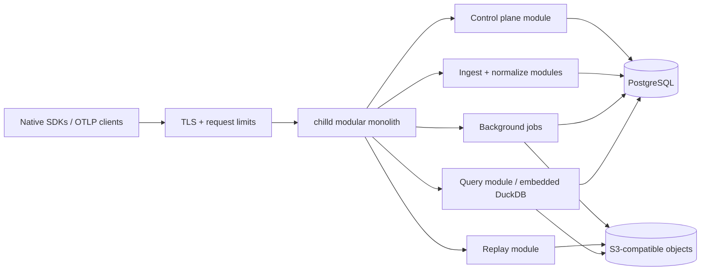

# ADR-0015: A Go modular monolith owns the frugal backend

- Status: Superseded by ADR-0026 (language selection only; service and data architecture retained)
- Date: 2026-07-15

## Context

Chill needs an authenticated OTLP receiver, tenant control plane, durable
ingest path, Parquet lake writer, DuckDB query service, encrypted replay path,
and background retention/compaction jobs. The first deployment must be cheap
and operable by one developer, but its contracts must survive a later move to
an external multi-tenant service.

The backend is not allowed to trade away correctness to achieve that
simplicity. It must acknowledge telemetry only after durable admission,
deduplicate at-least-once uploads, stamp tenant identity from authenticated
server state, bound every untrusted input, isolate analytical work from ingest,
and expose enough profiling evidence to show when one process has reached its
limit.

The architecture therefore needs to optimize four things together:

1. predictable resource use on a two-vCPU, 4 GiB starting host;
2. a short build-test-debug loop for one contributor;
3. mature OTLP, PostgreSQL, Parquet, object-store, and DuckDB integration; and
4. explicit seams that can be extracted without changing the canonical
   behavior contract.

## Decision drivers and alternatives

The comparison uses a five-point score. The weights reflect the initial
business constraint rather than a claim that one language is universally
better.

| Driver | Weight | Go | Rust | Kotlin/JVM | TypeScript | Python |
| --- | ---: | ---: | ---: | ---: | ---: | ---: |
| Small-deployment operability | 30% | 5 | 4 | 3 | 4 | 3 |
| Ingest performance and bounded concurrency | 25% | 4 | 5 | 4 | 3 | 2 |
| One-developer implementation speed | 20% | 5 | 3 | 3 | 5 | 5 |
| PostgreSQL/Parquet/DuckDB ecosystem | 15% | 4 | 4 | 5 | 3 | 5 |
| Contributor and build experience | 10% | 5 | 3 | 3 | 4 | 4 |
| Weighted result | 100% | **4.60** | 4.00 | 3.55 | 3.75 | 3.35 |

Rust offers the strongest control over allocation and CPU but adds substantial
implementation and build complexity before a profile demonstrates that Chill
needs it. Kotlin has excellent data tooling but a larger runtime floor for the
smallest host. TypeScript maximizes product iteration speed but places native
module and garbage-collection risk on the hottest and most stateful paths.
Python remains useful for offline validation and operational tools, but not as
the public ingest process.

## Decision

### Use Go 1.26 for one application binary

The backend is a Go 1.26 module that produces one `chilld` application binary.
The toolchain is pinned to the latest patched 1.26 release in `go.mod` and the
container build. Dependencies are pinned and checksummed. Generated OTLP
protobuf bindings and SQL migrations are versioned with the source.

Go is selected because its standard HTTP server, explicit concurrency,
low-runtime deployment, race detector, benchmarks, execution trace, and
`pprof` profiles fit both the ingest path and a one-person operational model.
The DuckDB binding introduces a C boundary; that boundary is confined to the
query module and built in a reproducible builder image.

Python continues to run the language-neutral contract validators. SQL remains
the query language inside the service. Neither is a second production service
language.

### Deploy one application process with two stateful dependencies

The initial deployment contains:

- one `chilld` process for public HTTP, internal APIs, and background workers;
- PostgreSQL for control-plane state, tenant-safe receipts, the durable ingest
  inbox, job leases, and lake manifests; and
- one S3-compatible object store for immutable Parquet and encrypted replay
  blobs.

DuckDB is embedded inside `chilld`. It reads only immutable files named by a
committed manifest; it does not own a shared writable database file. This
respects DuckDB's single-process write model and keeps analytical state
rebuildable. A reverse proxy may terminate public TLS, but it is not an
application service boundary.

There is initially no Kafka-compatible log, Redis cache, separate scheduler,
service mesh, or workflow engine. PostgreSQL advisory/row leases coordinate
jobs. Small bounded caches live in process and can always be rebuilt.



### Keep module ownership enforceable in code

The repository layout begins as follows:

```text
backend/
  cmd/chilld/                 process assembly only
  internal/contracts/        generated OTLP and canonical schema bindings
  internal/controlplane/     tenants, projects, keys, policy, quotas
  internal/ingest/           HTTP boundary, auth, limits, response semantics
  internal/normalize/        pure canonicalization, time, ordering, identity
  internal/inbox/            durable admission and idempotency receipts
  internal/lake/             Parquet layout, immutable manifests, compaction
  internal/query/            typed plans, DuckDB execution, cache and limits
  internal/replay/           ciphertext upload, index, acknowledgement
  internal/jobs/             leases, retries, retention and deletion workflows
  internal/platform/         config, clock, database, objects, health, telemetry
  migrations/                forward PostgreSQL migrations and fixtures
```

The rules are:

- `contracts` and small platform value types are leaves; they import no
  business module.
- A module owns its tables and object prefixes. Another module calls its Go
  interface instead of issuing SQL against those tables.
- HTTP handlers contain transport translation only. Domain behavior remains
  callable from integration tests without a socket.
- `cmd/chilld` wires concrete implementations and process lifecycle. It
  contains no domain decisions.
- Cross-module interfaces use canonical domain types, not driver rows,
  DuckDB values, or protobuf messages.
- Background execution uses the same module interface as synchronous work.
  Moving a worker to another process must not change its job payload contract.

Package-import tests and static analysis reject forbidden dependency edges.
This is a modular monolith, not a directory convention held together by hope.

### Acknowledge only a durable, tenant-stamped prefix

The OTLP/HTTP path is the first public transport. Binary protobuf plus gzip is
the normal client format; JSON protobuf is accepted only where the OTLP
contract requires it. gRPC can be added behind the same ingest interface when
measured client demand justifies a second transport.

The behavior ingest sequence is:

1. The edge applies header, compressed-body, decompressed-body, compression
   ratio, record-count, and request-deadline limits.
2. `ingest` authenticates the SDK key. The key identifies organization,
   project, and environment; client attributes never choose tenant scope.
3. OTLP decoding and `normalize` validate the exact canonical schema, redact
   untrusted fields, stamp receipt time, and compute record/idempotency keys.
4. One PostgreSQL transaction inserts new receipt keys and a compressed,
   canonical inbox batch. Existing keys are classified as acknowledged
   duplicates, not re-enqueued records.
5. The server returns the exact OTLP success, partial-success, permanent error,
   or retryable backpressure response only after that transaction commits.

The inbox is intentionally a temporary durable buffer, not the analytical
store. Workers claim batches with bounded PostgreSQL leases. They produce a
Parquet object under an immutable content-addressed key, then transactionally
publish its manifest and mark inbox records compacted. A failed upload has no
manifest; a failed manifest transaction leaves an unreachable object for a
later orphan sweep. There is no object rename and readers never discover files
by listing a prefix.

Encrypted replay bytes use a separate bounded endpoint. The server verifies
authenticated scope, declared size, digest, chunk identity, and correlated
metadata without decrypting UI content on the ingest edge. It writes an
immutable ciphertext object before committing the replay index and exact
acknowledgement.

### Keep data identity stable across extraction

Every accepted behavior record carries these trusted dimensions before it
enters the inbox:

- `organization_id`, `project_id`, `environment_id`, and `source_id` from the
  credential lookup;
- canonical schema version and URL;
- client record ID and server idempotency key;
- server receipt time, client wall time, boot-relative monotonic time, boot ID,
  and sequence number;
- subject, session, trace, span, replay chunk, and page identities where
  present; and
- classification, policy version, redaction state, and retention class.

These fields are independent of Go package names and database primary keys.
They remain the messages at a future service or durable-log boundary.

Parquet uses explicit schemas and immutable Hive-style partitions:

```text
v1/organization=<id>/project=<id>/environment=<id>/day=<yyyy-mm-dd>/hour=<hh>/kind=<kind>/part-<digest>.parquet
```

A manifest row stores the exact object key, digest, byte count, row count,
schema version, min/max receipt and occurrence times, tenant scope, and
compaction lineage. Query planning selects manifests under authenticated
tenant scope and passes an explicit list of objects to DuckDB.

### Isolate tenants at every boundary

SDK keys are random bearer credentials with a visible lookup prefix. The
database stores the prefix and a server-peppered HMAC digest, never the secret.
Comparison is constant-time, keys are environment-scoped, and rotation permits
a short explicit overlap.

Every tenant-owned PostgreSQL row has the full trusted scope or an immutable
foreign-key path to it. Application queries require scope parameters.
PostgreSQL row-level security is enabled and forced as defense in depth; the
runtime role does not own tables and has no `BYPASSRLS`. Each transaction uses
`SET LOCAL` trusted scope. Migrations and backup roles are separate and cannot
serve traffic.

The query API accepts typed, versioned query plans rather than arbitrary SQL.
It resolves only manifest rows in scope, uses parameter binding, rejects
unbounded time ranges/cardinality, applies a concurrency semaphore, sets
DuckDB memory and thread limits, supports context cancellation, and caps result
rows and serialized bytes. Cache keys include tenant scope, manifest version,
query version, parameters, and policy version.

### Bound concurrency instead of spawning through overload

Every work class has an explicit admission limit:

- public HTTP has connection, header, body, decompression, parse, and deadline
  limits;
- normalization has a bounded worker pool sized from available CPUs;
- inbox commits have a separate PostgreSQL pool and queue timeout;
- compaction, deletion, and orphan sweeping use leased jobs with retry caps;
- DuckDB has a small independent query semaphore and hard memory/thread caps;
  and
- replay uploads have separate request and object-size budgets.

When a limit is reached, OTLP receives only specification-defined retryable
codes (`429`, `502`, `503`, or `504` as applicable), with `Retry-After` for
server throttling. Permanent validation failures return `400` and are never
made retryable. Health endpoints distinguish process liveness from readiness
to durably accept data.

### Observe Chill without recursively depending on Chill

The process emits standard OpenTelemetry metrics and traces to a separately
configured operations destination. Internal telemetry never enters the tenant
behavior inbox by default. Structured logs use bounded reason codes and stable
identifiers; request bodies, credentials, raw annotations, replay content, and
query results are forbidden.

Required internal signals include:

- requests, decoded bytes/records, rejects, duplicates, partial success, and
  retry status by route and bounded reason;
- inbox depth/bytes/age, PostgreSQL pool waits, commits, and WAL growth;
- compaction rows/bytes/duration, manifest lag, orphan objects, and dead letters;
- query queue time, planning/execution/serialization time, scanned files/bytes,
  cache decisions, cancellation, and peak memory; and
- replay upload bytes, digest rejects, pending age, and acknowledgement.

Go CPU, heap, allocation, goroutine, mutex, block, and execution-trace
diagnostics are available only on an authenticated loopback/admin listener.

## Profiling and release criteria

All numbers are measured in optimized containers on the floor deployment: two
vCPUs, 4 GiB RAM, bounded local PostgreSQL, and S3-compatible object storage.
Loopback-only benchmarks do not replace a deployment run.

The first release profile is:

| Workload | Required evidence |
| --- | --- |
| Ingest steady state | 100 records/s for 30 minutes; p95 acknowledgement under 150 ms, p99 under 500 ms, zero acknowledged loss |
| Ingest burst | 1,000 records/s for 10 seconds; bounded memory, no process failure, exact retry signaling |
| Offline duplicate recovery | 100,000 shuffled records with retries and clock skew; one canonical row per record ID |
| Compaction | p95 durable-inbox-to-manifest lag under five minutes at rated load; recover after a kill at every publish boundary |
| Event exploration | 10 million rows over seven days; p95 under one second warm and three seconds cold for a bounded page |
| Funnel/cohort | One million subjects over a 30-day bound; p95 under five seconds with cancellation and result caps |
| Resource floor | Under 60% sustained CPU at ingest steady state; under 3 GiB process RSS during the largest permitted query |
| Recovery | Restore PostgreSQL plus object manifests and rebuild derived state without acknowledged-record loss |

Each hot package has `go test -bench` allocation evidence. Integration runs
capture `pprof` CPU/heap/mutex/block profiles, Go execution traces, PostgreSQL
query plans and WAL volume, DuckDB profiles, object bytes, and end-to-end
latency histograms. Profiles are retained as release artifacts with commit,
toolchain, image digest, schema, dataset, and host provenance.

An optimization is accepted only after a profile identifies the dominant cost
and a paired benchmark shows the improvement without weakening a contract.

## Extraction and migration criteria

Crossing one threshold starts a measured design review; it does not
automatically create a service.

| Boundary | Review trigger | Earliest extraction |
| --- | --- | --- |
| Public ingest | Three production days above 1,000 records/s sustained, ingest consumes over 50% of both vCPUs, or p99 misses after profile-led optimization | Stateless Go receiver using the same normalize/inbox interface |
| Durable inbox | Inbox/WAL exceeds 25% of PostgreSQL storage, compaction lag exceeds 15 minutes at rated load, or restore time exceeds 30 minutes | Partitioned durable log adapter behind the inbox contract |
| Compaction/jobs | Background work consumes over 25% CPU while causing two consecutive query or ingest SLO misses | Separate `chill-worker` process with the same leased job payloads |
| Query | More than four concurrent permitted queries require isolation, query RSS threatens ingest, or interactive p95 misses on the floor host | Separate query process reading the same committed manifests |
| Control plane | Independent compliance boundary, availability target, release cadence, or owning team appears | Small control-plane service; tenant/key lookup contract remains versioned |
| Cache | Credential or query-cache database work exceeds 5% CPU after bounded in-process caching | External cache with PostgreSQL/object truth and safe cache misses |

Go itself is reconsidered for a boundary only when both conditions hold:

1. profiles show that boundary consumes at least 30% of the deployment's CPU or
   memory budget after normal optimization; and
2. a production-shaped Rust, JVM, or native prototype is at least twice as
   efficient while preserving correctness, build reproducibility, diagnostics,
   and contributor latency.

A DuckDB binding that cannot be reproduced across supported deployment targets
is an independent reason to move the query module behind an ADBC/IPC process
boundary. Neither condition justifies a whole-platform rewrite.

## Consequences

- The initial system has one application release and no distributed-service
  failure modes, while PostgreSQL and object storage remain independently
  recoverable.
- PostgreSQL temporarily carries ingest bytes and receipts. This is deliberate
  at tiny scale and is monitored as a migration trigger, not treated as the
  permanent data lake.
- Embedded DuckDB provides strong small-scale analytical performance but query
  concurrency must be deliberately limited.
- The C boundary for DuckDB complicates otherwise straightforward Go builds;
  reproducible multi-stage images and smoke tests are mandatory.
- Module interfaces and table ownership add some ceremony now, but make a
  future extraction a deployment change instead of a behavior-contract rewrite.
- A single process is not a promise to stay single-process. It is the cheapest
  architecture that can produce trustworthy measurements for the next one.

## Verification

CHILL-21 through CHILL-27 implement this decision. Their acceptance suites must
prove migrations and restore, OTLP retry semantics, canonical ordering,
idempotency, immutable Parquet publication, tenant-scoped DuckDB queries,
deletion propagation, deployment resource caps, and kill-point recovery.

The architecture is reviewed after the first internal 30-day workload and at
every extraction threshold. A review records the profile, rejected cheaper
optimizations, and whether the boundary contract is sufficient.

## References

- [Go diagnostics and pprof](https://go.dev/doc/diagnostics)
- [Go module dependency management](https://go.dev/doc/modules/managing-dependencies)
- [OpenTelemetry Protocol specification](https://opentelemetry.io/docs/specs/otlp/)
- [OTLP exporter and retry requirements](https://opentelemetry.io/docs/specs/otel/protocol/exporter/)
- [DuckDB concurrency](https://duckdb.org/docs/current/connect/concurrency)
- [DuckDB Parquet reads and writes](https://duckdb.org/docs/stable/data/parquet/overview)
- [PostgreSQL row security policies](https://www.postgresql.org/docs/current/ddl-rowsecurity.html)
- [PostgreSQL SQL-dump backup and restore](https://www.postgresql.org/docs/current/backup-dump.html)
